# Create Course
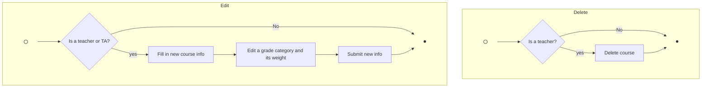
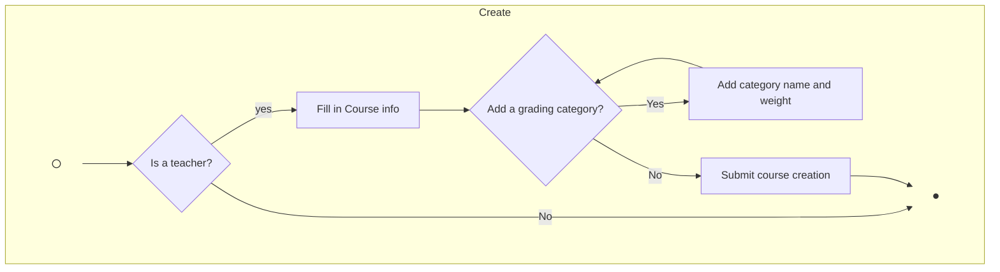

# Editing TA
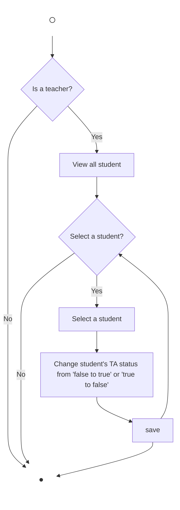

# Account Authentication
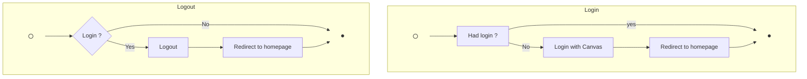

# Create Assignments, Tests, or Quizzes
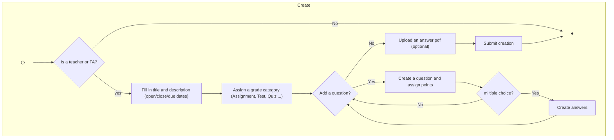

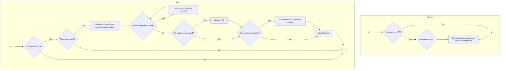

# Grading
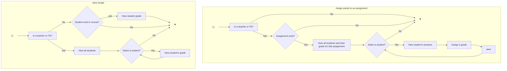

# Discussion
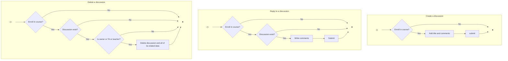
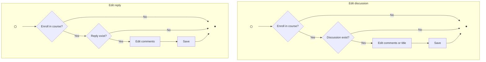

# Inbox
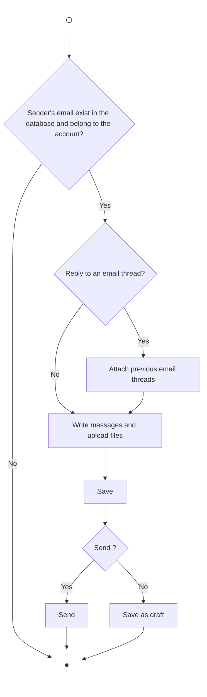

## Chatbox
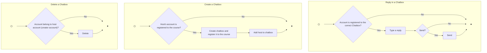

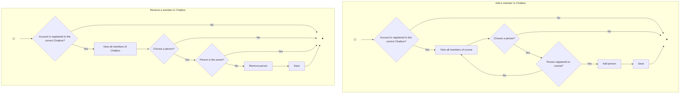

## Profile
```mermaid
graph TD
classDef points fill:transparant,stroke:none,stroke-width:0px, fill-opacity:0, font-size:30px

subgraph Edit Profile
    start["#cir;"]:::points
    exit["#bull;"]:::points

    start --> vr{"Valid JSON Web Token (JWT)?"}
    vr --> |No| Logout --> exit
    vr --> |Yes| edit[Edit Nickname and Bio]
    edit --> c[Add preferable email contacts]
    c --> pf[Change Profile Picture]
    pf --> s{Save ?}
    s --> |No| exit
    s --> |Yes| Save
    Save --> exit
end

subgraph Change Settings
    start1["#cir;"]:::points
    exit1["#bull;"]:::points

    start1 --> vr1{"Valid JSON Web Token (JWT)?"}
    vr1 --> |No| Logout1[Logout] --> exit1
    vr1 --> |Yes| c1[On/Off Emailing Inboxes Notification]
    c1 --> c1.1[On/Off Emailing Calendar Notification]
    c1.1 --> c1.2[On/Off Emailing Assignment due dates Notification]
    c1.2 --> c1.3[On/Off Emailing Grading Notification]
    c1.3 --> c1.4[On/Off Emailing To-do-list Notification]
    c1.4 --> c2[Add github account]
    c2 --> c3[Add google drive account]
    c3 --> c4[Change dashboard color theme]
    c4 --> c5[Change Fontsize]
    c5 --> s2[Save] --> exit1
end
```

## Announcement
```mermaid
graph TD
classDef points fill:transparant,stroke:none,stroke-width:0px, fill-opacity:0, font-size:30px

subgraph Create Announcement
    start["#cir;"]:::points
    exit["#bull;"]:::points

    start --> vr{Is TA or Teacher of course?}
    vr --> |No| exit
    vr --> |Yes| wr[Write Announcement]
    wr --> send{Send ?}
    send --> |No| exit
    send --> |Yes| Send --> exit
end

subgraph Edit Announcement
    start2["#cir;"]:::points
    exit2["#bull;"]:::points

    start2 --> vr2{Is TA or Teacher of course?}
    vr2 --> |No| exit2
    vr2 --> |Yes| ex[Is announcement exist?]

    ex --> |No| exit2

    ex --> |Yes| wr2[Edit Announcement]
    wr2 --> send2{Send ?}
    send2 --> |No| exit2
    send2 --> |Yes| zz[Send] --> exit2
end

subgraph Delete Announcement
    start3["#cir;"]:::points
    exit3["#bull;"]:::points

    start3 --> vr3{Is TA or Teacher of course?}
    vr3 --> |No| exit3
    vr3 --> |Yes| ex3[Is announcement exist?]

    ex3 --> |No| exit3

    ex3 --> |Yes| send3{Delete ?}
    send3 --> |No| exit3
    send3 --> |Yes| zz3[Delete] --> exit3
end
```

## Calendar
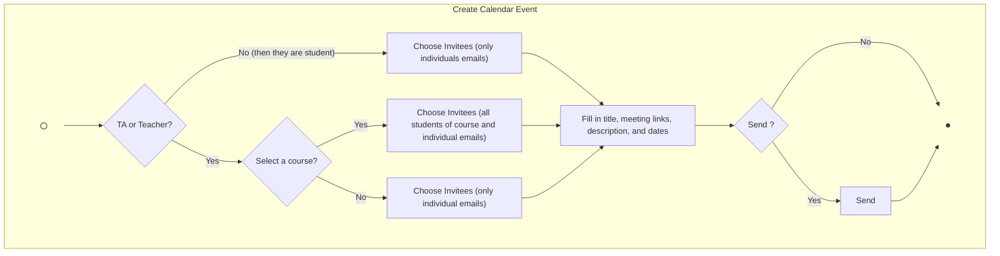
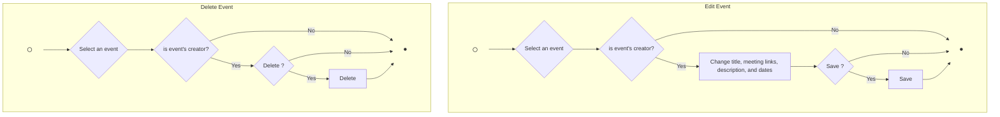

## To-do list
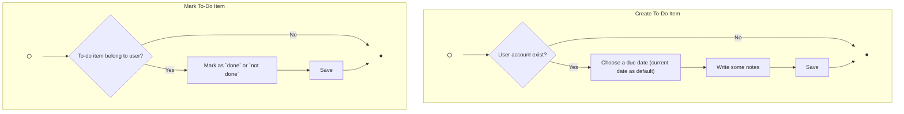
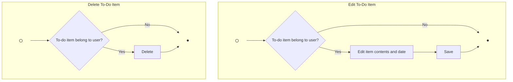

## Notes
```mermaid
graph TD
classDef points fill:transparant,stroke:none,stroke-width:0px, fill-opacity:0, font-size:30px

subgraph Create Notes
    start["#cir;"]:::points
    exit["#bull;"]:::points

    start --> us[User create a note]
    us --> date["Choose a date (default on current date)"]
    date --> c{Choose a course for the note?}
    
    c--> |No| wr[Write some notes]
    c--> |Yes| rg[Register notes to course for easy access] --> wr
    wr --> Save --> exit
end

subgraph Edit Notes
    start2["#cir;"]:::points
    exit2["#bull;"]:::points

    start2 --> vr{Selected note belong to user?}
    vr --> |No| exit2
    vr --> |Yes| edit[Edit notes and dates]
    edit --> s2[Save] --> exit2
end

subgraph Delete Notes
    start3["#cir;"]:::points
    exit3["#bull;"]:::points

    start3 --> vr3{Selected note belong to user?}
    vr3 --> |No| exit3
    vr3 --> |Yes| Delete --> exit3
end
```

## Personalize Dashboard
```mermaid
graph TD
classDef points fill:transparant,stroke:none,stroke-width:0px, fill-opacity:0, font-size:30px

subgraph Move Dashboard Item
    start["#cir;"]:::points
    exit["#bull;"]:::points

    start --> vr{Verified JWT?}
    vr --> |No| lg1[Logout] --> exit
    vr --> |Yes| ed[go to Edit mode] --> mv[Move items on dashboard to desired location]
    mv --> Save --> exit
end

subgraph Show/Hide Dashboard Item
    start2["#cir;"]:::points
    exit2["#bull;"]:::points

    start2 --> vr2{Verified JWT?}
    vr2 --> |No| lg[Logout] --> exit2
    vr2 --> ed2[go to Edit mode] --> shw[Show Items Window] --> sh[Show/Hide items]
    sh --> s3[Save] --> exit2
end

subgraph Resize Dashboard Item
    start3["#cir;"]:::points
    exit3["#bull;"]:::points

    start3 --> vr3{Verified JWT?}
    vr3 --> |No| lg4[Logout] --> exit3
    vr3 --> ed3[go to Edit mode] --> rz[Drag at corner to resize items on dashboard]
    rz --> s2[Save] --> exit3
end
```