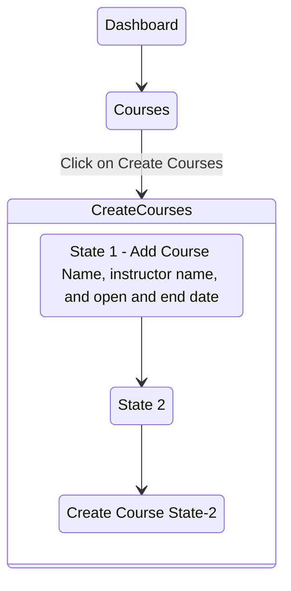

```mermaid

stateDiagram-v2
  
    Dashboard --> Courses

    Courses --> CreateCourses : Click on Create Courses

    state CreateCourses {
        s1: State 1 - Add Course Name, instructor name, and open and end date
        s2: State 2 
        s3: Create Course State-2

        s1 --> s2
        s2 --> s3

    }

```