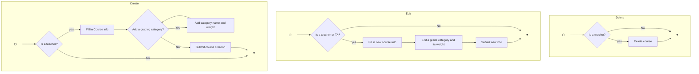
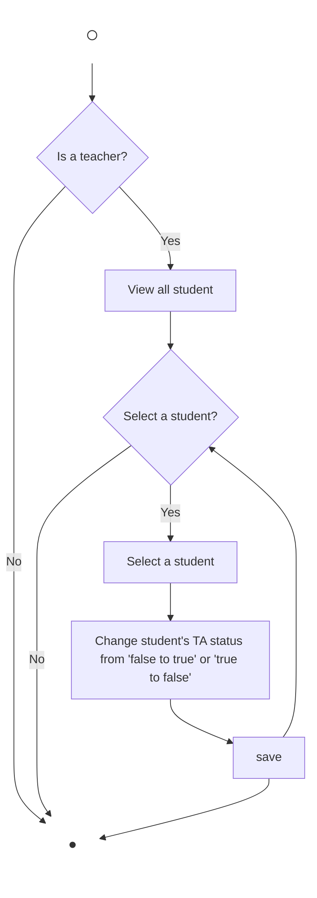
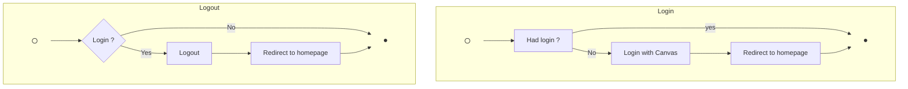
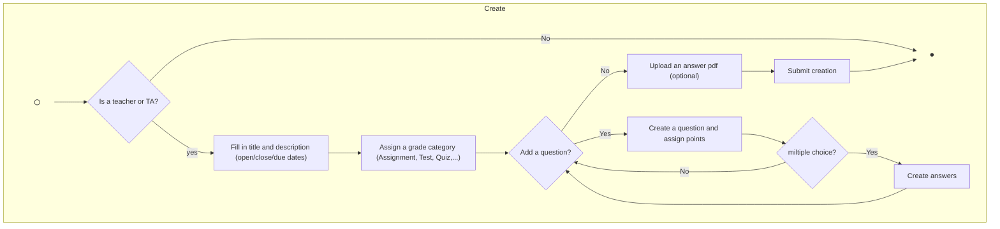
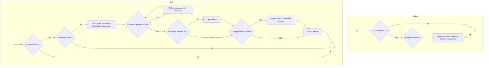
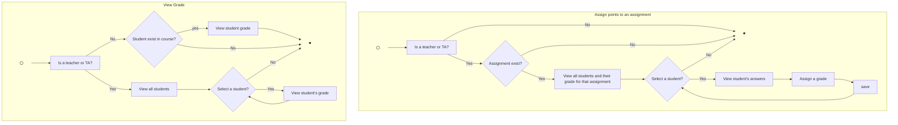
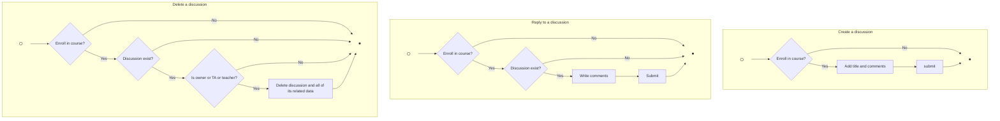
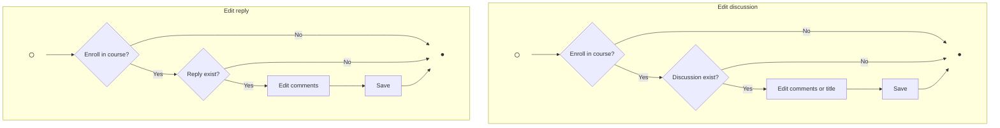

# Create Course

```mermaid
graph TD
classDef points fill:transparant,stroke:none,stroke-width:0px, fill-opacity:0, font-size:30px

subgraph Delete
    start2["#cir;"]:::points
    exit2["#bull;"]:::points

    start2 --> id2.2{Is a teacher?};
    id2.2 -->|yes| fill2[Delete course];
    id2.2 -->|No| exit2;
    fill2 --> exit2
end

subgraph Edit
    start1["#cir;"]:::points
    exit1["#bull;"]:::points

    start1 --> id2.1{Is a teacher or TA?};
    id2.1 -->|yes| fill1[Fill in new course info];
    id2.1 -->|No| exit1;
    fill1 --> fill11[Edit a grade category and its weight]
    fill11 --> sub1[Submit new info];
    sub1 --> exit1
end

subgraph Create
    start["#cir;"]:::points
    exit["#bull;"]:::points

    start --> id2{Is a teacher?};
    id2 -->|yes| fill[Fill in Course info];
    id2 -->|No| exit;
    fill --> fill22{Add a grading category?}

    fill22 --> |Yes| g[Add category name and weight]
    g --> fill22
    fill22 --> |No| sub[Submit course creation];
    sub --> exit
end
```

# Editing TA

```mermaid
graph TD
    classDef points fill:transparant,stroke:none,stroke-width:0px, fill-opacity:0, font-size:30px

    start["#cir;"]:::points
    exit["#bull;"]:::points

    start --> id{Is a teacher?}
    id --> |No| exit
    id --> |Yes| v[View all student]
    v --> sel{Select a student?}

    sel --> |No| exit
    sel --> |Yes| se[Select a student]
    se --> c["Change student's TA status from 'false to true' or 'true to false'"]
    c --> s[save]
    s --> sel
    s --> exit
```

# Account Authentication

```mermaid
graph TD
classDef points fill:transparant,stroke:none,stroke-width:0px, fill-opacity:0, , font-size:30px

subgraph Login
    start1["#cir;"]:::points
    exit1["#bull;"]:::points

    start1 --> l[Had login ?]
    l --> |yes| exit1
    l --> |No| ll[Login with Canvas]
    ll --> r[Redirect to homepage]
    r --> exit1
end

subgraph Logout
    start2["#cir;"]:::points
    exit2["#bull;"]:::points

    start2 --> l1{Login ?}
    l1 --> |No| exit2
    l1 --> |Yes| l2[Logout]
    l2 --> r2[Redirect to homepage]
    r2 --> exit2
end
```

# Create Assignments, Tests, or Quizzes

```mermaid
graph TD
classDef points fill:transparant,stroke:none,stroke-width:0px, fill-opacity:0, font-size:30px

subgraph Create
    start["#cir;"]:::points
    exit["#bull;"]:::points

    start --> id2{Is a teacher or TA?};
    id2 -->|yes| fill["Fill in title and description (open/close/due dates)"];
    fill --> f2["Assign a grade category (Assignment, Test, Quiz,...)"]
    f2 --> q{Add a question?}
    id2 --> |No| exit

    q --> |Yes| q1[Create a question and assign points]
    q1 --> m{miltiple choice?}
    m --> |Yes| a[Create answers]
    a --> q
    m --> |No| q

    q --> |No| sub["Upload an answer pdf (optional)"]
    sub --> sub2[Submit creation]
    sub2 --> exit
end
```

```mermaid
graph TD
classDef points fill:transparant,stroke:none,stroke-width:0px, fill-opacity:0, font-size:30px

subgraph Delete
    start2["#cir;"]:::points
    exit2["#bull;"]:::points

    start2 --> is2{Is a teacher or TA?};
    is2 --> |Yes| ex2{Assignment exist?}
    is2 --> |No| exit2

    ex2 --> d[Delete the assignment and all of its related data]
    d --> exit2
end

subgraph Edit
    start["#cir;"]:::points
    exit["#bull;"]:::points

    start --> id2{Is a teacher or TA?};
    id2 --> |Yes| ex{Assignment exist?}
    id2 --> |No| exit

    ex --> |Yes| q["Edit title and description (open/close/due dates)"]
    q --> q2{Choose a question to edit?}
    q2 --> |Yes| q3[Edit question and its answers]
    q3 --> q2
    ex --> |No| exit

    q2 --> |No| q4{Re-upload answers pdf?}
    q4 --> |Yes| up[Upload PDF]
    q4 --> |No| st{Change status to visible?}
    up --> st

    st --> |Yes| stt[Change status to visible to student]
    st --> |No| s[Save Changes]
    stt --> s

    s --> exit 
end
```

# Grading

```mermaid
graph TD
classDef points fill:transparant,stroke:none,stroke-width:0px, fill-opacity:0, font-size:30px

subgraph Assign points to an assignment
    start["#cir;"]:::points
    exit["#bull;"]:::points

    start --> id[Is a teacher or TA?]
    id --> |No| exit
    id --> |Yes| a{Assignment exist?}

    a --> |No| exit
    a --> |Yes| v[View all students and their grade for that assignment]
    
    v --> sel{Select a student?}
    sel --> |No| exit
    sel --> |Yes| va[View student's answers]
    va --> as[Assign a grade]
    as --> save
    save --> sel
end

subgraph View Grade
    start2["#cir;"]:::points
    exit2["#bull;"]:::points

    start2 --> id2[Is a teacher or TA?]
    id2 --> |No| g2{Student exist in course?}
    id2 --> |Yes| v2[View all students]
    
    v2 --> sel2{Select a student?}
    sel2 --> |No| exit2
    sel2 --> |Yes| va2[View student's grade]
    va2 --> sel2

    g2 --> |yes| g3[View student grade]
    g3 --> exit2
    g2 --> |No| exit2
end
```

# Discussion

```mermaid
graph TD
classDef points fill:transparant,stroke:none,stroke-width:0px, fill-opacity:0, font-size:30px

subgraph Create a discussion
    start["#cir;"]:::points
    exit["#bull;"]:::points

    start --> id{Enroll in course?}
    id --> |No| exit
    id --> |Yes| a[Add title and comments]
    a --> submit --> exit
end

subgraph Reply to a discussion
    start2["#cir;"]:::points
    exit2["#bull;"]:::points

    start2 --> id2{Enroll in course?}
    id2 --> |No| exit2
    id2 --> |Yes| d2{Discussion exist?}

    d2 --> |No| exit2
    d2 --> |Yes| w2[Write comments]
    w2 --> sub2[Submit] --> exit2
end

subgraph Delete a discussion
    start3["#cir;"]:::points
    exit3["#bull;"]:::points

    start3 --> id3{Enroll in course?}
    id3 --> |No| exit3
    id3 --> |Yes| d3{Discussion exist?}

    d3 --> |No| exit3
    d3 --> |Yes| idd3{Is owner or TA or teacher?}

    idd3 --> |No| exit3
    idd3 --> |Yes| dd3[Delete discussion and all of its related data]
    dd3 --> exit3
end
```

```mermaid
graph TD
classDef points fill:transparant,stroke:none,stroke-width:0px, fill-opacity:0, font-size:30px

subgraph Edit discussion
    start["#cir;"]:::points
    exit["#bull;"]:::points

    start --> id{Enroll in course?}
    id --> |No| exit
    id --> |Yes| d{Discussion exist?}

    d --> |No| exit
    d --> |Yes| ed[Edit comments or title]
    ed --> Save --> exit
end

subgraph Edit reply
    start2["#cir;"]:::points
    exit2["#bull;"]:::points

    start2 --> id2{Enroll in course?}
    id2 --> |No| exit2
    id2 --> |Yes| d2{Reply exist?}

    d2 --> |No| exit2
    d2 --> |Yes| ed2[Edit comments]
    ed2 --> save2[Save] --> exit2
end
```