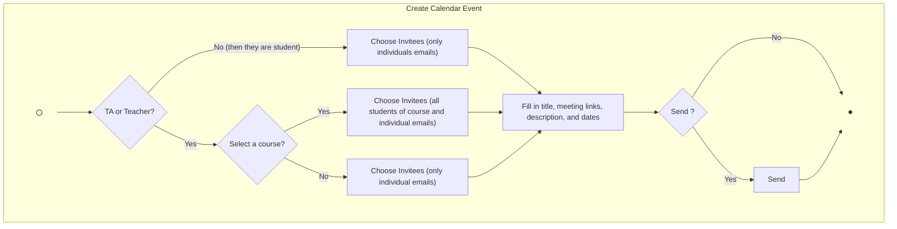
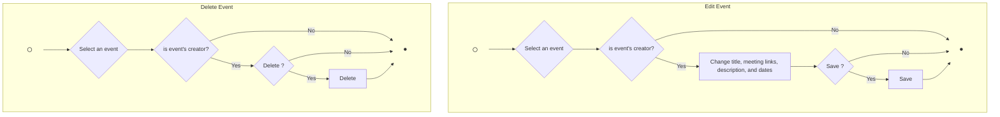

## Calendar

```mermaid
graph TD
classDef points fill:transparant,stroke:none,stroke-width:0px, fill-opacity:0, font-size:30px

subgraph Create Calendar Event
    start["#cir;"]:::points
    exit["#bull;"]:::points
    
    start --> vr{TA or Teacher?}

    vr --> |"No (then they are student)"| cs["Choose Invitees (only individuals emails)"]
    vr --> |Yes| sel{Select a course?}
    sel --> |Yes| c["Choose Invitees (all students of course and individual emails)"]
    sel --> |No| cc["Choose Invitees (only individual emails)"]

    c --> fill[Fill in title, meeting links, description, and dates]
    cs --> fill
    cc --> fill

    fill --> s{Send ?}
    s--> |No| exit
    s--> |Yes| Send --> exit
end
```

```mermaid
graph TD
classDef points fill:transparant,stroke:none,stroke-width:0px, fill-opacity:0, font-size:30px

subgraph Edit Event
    start["#cir;"]:::points
    exit["#bull;"]:::points
    
    start --> sel{Select an event}
    sel --> vr{"is event's creator?"}
    vr --> |No| exit
    vr --> |Yes| cha[Change title, meeting links, description, and dates]
    cha --> s{Save ?}
    s --> |No| exit
    s --> |Yes| Save --> exit
end

subgraph Delete Event
    start2["#cir;"]:::points
    exit2["#bull;"]:::points
    
    start2 --> sel2{Select an event}
    sel2 --> vr2{"is event's creator?"}
    vr2 --> |No| exit2
    vr2 --> |Yes| s2{Delete ?}
    s2 --> |No| exit2
    s2 --> |Yes| Delete --> exit2
end
```