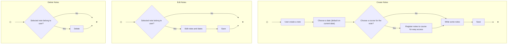

## Notes

```mermaid
graph TD
classDef points fill:transparant,stroke:none,stroke-width:0px, fill-opacity:0, font-size:30px

subgraph Create Notes
    start["#cir;"]:::points
    exit["#bull;"]:::points

    start --> us[User create a note]
    us --> date["Choose a date (default on current date)"]
    date --> c{Choose a course for the note?}
    
    c--> |No| wr[Write some notes]
    c--> |Yes| rg[Register notes to course for easy access] --> wr
    wr --> Save --> exit
end

subgraph Edit Notes
    start2["#cir;"]:::points
    exit2["#bull;"]:::points

    start2 --> vr{Selected note belong to user?}
    vr --> |No| exit2
    vr --> |Yes| edit[Edit notes and dates]
    edit --> s2[Save] --> exit2
end

subgraph Delete Notes
    start3["#cir;"]:::points
    exit3["#bull;"]:::points

    start3 --> vr3{Selected note belong to user?}
    vr3 --> |No| exit3
    vr3 --> |Yes| Delete --> exit3
end
```