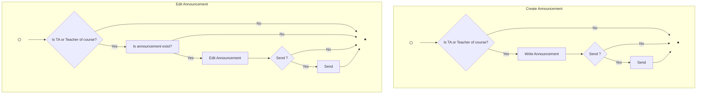
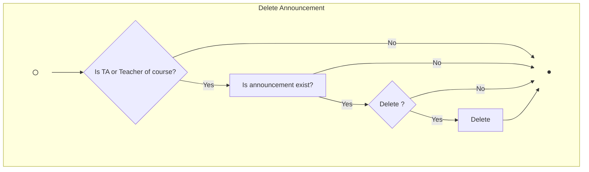

## Announcement

```mermaid
graph TD
classDef points fill:transparant,stroke:none,stroke-width:0px, fill-opacity:0, font-size:30px

subgraph Create Announcement
    start["#cir;"]:::points
    exit["#bull;"]:::points

    start --> vr{Is TA or Teacher of course?}
    vr --> |No| exit
    vr --> |Yes| wr[Write Announcement]
    wr --> send{Send ?}
    send --> |No| exit
    send --> |Yes| Send --> exit
end

subgraph Edit Announcement
    start2["#cir;"]:::points
    exit2["#bull;"]:::points

    start2 --> vr2{Is TA or Teacher of course?}
    vr2 --> |No| exit2
    vr2 --> |Yes| ex[Is announcement exist?]

    ex --> |No| exit2

    ex --> |Yes| wr2[Edit Announcement]
    wr2 --> send2{Send ?}
    send2 --> |No| exit2
    send2 --> |Yes| zz[Send] --> exit2
end
```

```mermaid
graph TD
classDef points fill:transparant,stroke:none,stroke-width:0px, fill-opacity:0, font-size:30px
subgraph Delete Announcement
    start3["#cir;"]:::points
    exit3["#bull;"]:::points

    start3 --> vr3{Is TA or Teacher of course?}
    vr3 --> |No| exit3
    vr3 --> |Yes| ex3[Is announcement exist?]

    ex3 --> |No| exit3

    ex3 --> |Yes| send3{Delete ?}
    send3 --> |No| exit3
    send3 --> |Yes| zz3[Delete] --> exit3
end
```