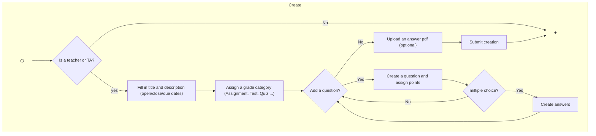
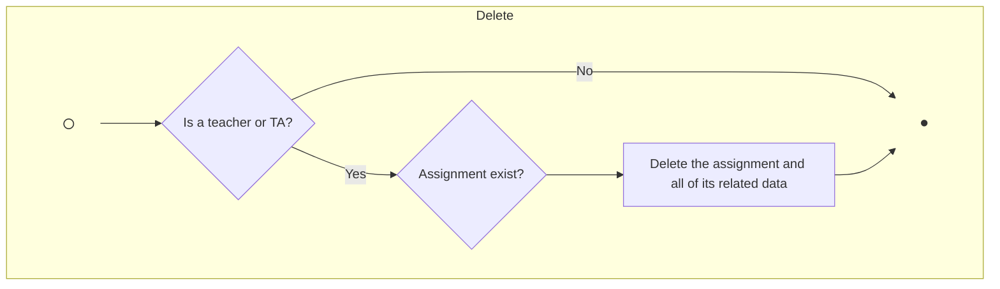
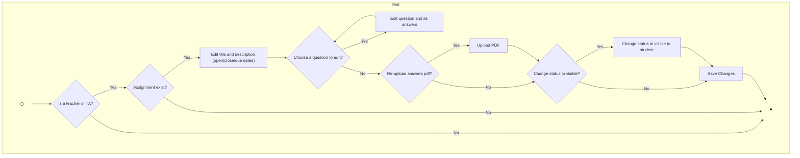

# Create Assignments, Tests, or Quizzes

```mermaid
graph TD
classDef points fill:transparant,stroke:none,stroke-width:0px, fill-opacity:0, font-size:30px

subgraph Create
    start["#cir;"]:::points
    exit["#bull;"]:::points

    start --> id2{Is a teacher or TA?};
    id2 -->|yes| fill["Fill in title and description (open/close/due dates)"];
    fill --> f2["Assign a grade category (Assignment, Test, Quiz,...)"]
    f2 --> q{Add a question?}
    id2 --> |No| exit

    q --> |Yes| q1[Create a question and assign points]
    q1 --> m{miltiple choice?}
    m --> |Yes| a[Create answers]
    a --> q
    m --> |No| q

    q --> |No| sub["Upload an answer pdf (optional)"]
    sub --> sub2[Submit creation]
    sub2 --> exit
end
```

```mermaid
graph TD
classDef points fill:transparant,stroke:none,stroke-width:0px, fill-opacity:0, font-size:30px

subgraph Delete
    start2["#cir;"]:::points
    exit2["#bull;"]:::points

    start2 --> is2{Is a teacher or TA?};
    is2 --> |Yes| ex2{Assignment exist?}
    is2 --> |No| exit2

    ex2 --> d[Delete the assignment and all of its related data]
    d --> exit2
end
```

```mermaid
graph TD
classDef points fill:transparant,stroke:none,stroke-width:0px, fill-opacity:0, font-size:30px

subgraph Edit
    start["#cir;"]:::points
    exit["#bull;"]:::points

    start --> id2{Is a teacher or TA?};
    id2 --> |Yes| ex{Assignment exist?}
    id2 --> |No| exit

    ex --> |Yes| q["Edit title and description (open/close/due dates)"]
    q --> q2{Choose a question to edit?}
    q2 --> |Yes| q3[Edit question and its answers]
    q3 --> q2
    ex --> |No| exit

    q2 --> |No| q4{Re-upload answers pdf?}
    q4 --> |Yes| up[Upload PDF]
    q4 --> |No| st{Change status to visible?}
    up --> st

    st --> |Yes| stt[Change status to visible to student]
    st --> |No| s[Save Changes]
    stt --> s

    s --> exit 
end
```