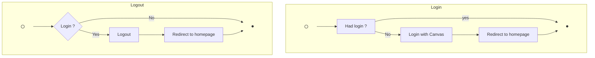

## Account Authentication

```mermaid
graph TD
classDef points fill:transparant,stroke:none,stroke-width:0px, fill-opacity:0, , font-size:30px

subgraph Login
    start1["#cir;"]:::points
    exit1["#bull;"]:::points

    start1 --> l[Had login ?]
    l --> |yes| exit1
    l --> |No| ll[Login with Canvas]
    ll --> r[Redirect to homepage]
    r --> exit1
end

subgraph Logout
    start2["#cir;"]:::points
    exit2["#bull;"]:::points

    start2 --> l1{Login ?}
    l1 --> |No| exit2
    l1 --> |Yes| l2[Logout]
    l2 --> r2[Redirect to homepage]
    r2 --> exit2
end
```