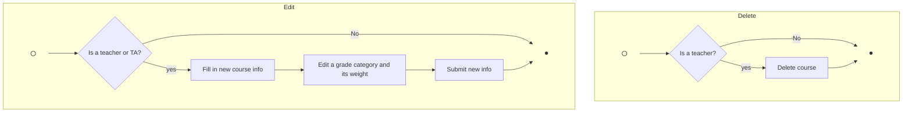
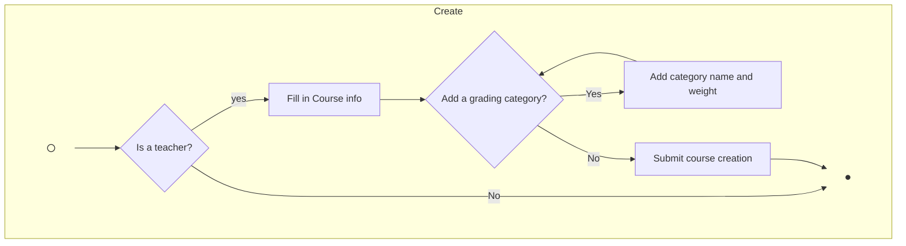

## Create Course

```mermaid
graph TD
classDef points fill:transparant,stroke:none,stroke-width:0px, fill-opacity:0, font-size:30px

subgraph Delete
    start2["#cir;"]:::points
    exit2["#bull;"]:::points

    start2 --> id2.2{Is a teacher?};
    id2.2 -->|yes| fill2[Delete course];
    id2.2 -->|No| exit2;
    fill2 --> exit2
end

subgraph Edit
    start1["#cir;"]:::points
    exit1["#bull;"]:::points

    start1 --> id2.1{Is a teacher or TA?};
    id2.1 -->|yes| fill1[Fill in new course info];
    id2.1 -->|No| exit1;
    fill1 --> fill11[Edit a grade category and its weight]
    fill11 --> sub1[Submit new info];
    sub1 --> exit1
end
```

```mermaid
graph TD
classDef points fill:transparant,stroke:none,stroke-width:0px, fill-opacity:0, font-size:30px
subgraph Create
    start["#cir;"]:::points
    exit["#bull;"]:::points

    start --> id2{Is a teacher?};
    id2 -->|yes| fill[Fill in Course info];
    id2 -->|No| exit;
    fill --> fill22{Add a grading category?}

    fill22 --> |Yes| g[Add category name and weight]
    g --> fill22
    fill22 --> |No| sub[Submit course creation];
    sub --> exit
end
```