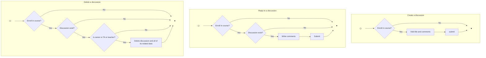
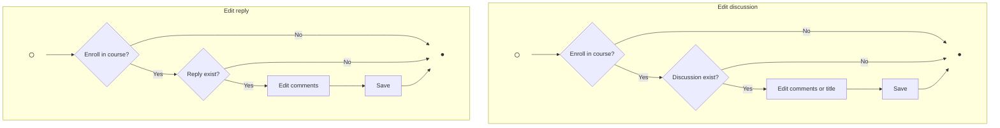

## Discussion

```mermaid
graph TD
classDef points fill:transparant,stroke:none,stroke-width:0px, fill-opacity:0, font-size:30px

subgraph Create a discussion
    start["#cir;"]:::points
    exit["#bull;"]:::points

    start --> id{Enroll in course?}
    id --> |No| exit
    id --> |Yes| a[Add title and comments]
    a --> submit --> exit
end

subgraph Reply to a discussion
    start2["#cir;"]:::points
    exit2["#bull;"]:::points

    start2 --> id2{Enroll in course?}
    id2 --> |No| exit2
    id2 --> |Yes| d2{Discussion exist?}

    d2 --> |No| exit2
    d2 --> |Yes| w2[Write comments]
    w2 --> sub2[Submit] --> exit2
end

subgraph Delete a discussion
    start3["#cir;"]:::points
    exit3["#bull;"]:::points

    start3 --> id3{Enroll in course?}
    id3 --> |No| exit3
    id3 --> |Yes| d3{Discussion exist?}

    d3 --> |No| exit3
    d3 --> |Yes| idd3{Is owner or TA or teacher?}

    idd3 --> |No| exit3
    idd3 --> |Yes| dd3[Delete discussion and all of its related data]
    dd3 --> exit3
end
```

```mermaid
graph TD
classDef points fill:transparant,stroke:none,stroke-width:0px, fill-opacity:0, font-size:30px

subgraph Edit discussion
    start["#cir;"]:::points
    exit["#bull;"]:::points

    start --> id{Enroll in course?}
    id --> |No| exit
    id --> |Yes| d{Discussion exist?}

    d --> |No| exit
    d --> |Yes| ed[Edit comments or title]
    ed --> Save --> exit
end

subgraph Edit reply
    start2["#cir;"]:::points
    exit2["#bull;"]:::points

    start2 --> id2{Enroll in course?}
    id2 --> |No| exit2
    id2 --> |Yes| d2{Reply exist?}

    d2 --> |No| exit2
    d2 --> |Yes| ed2[Edit comments]
    ed2 --> save2[Save] --> exit2
end
```