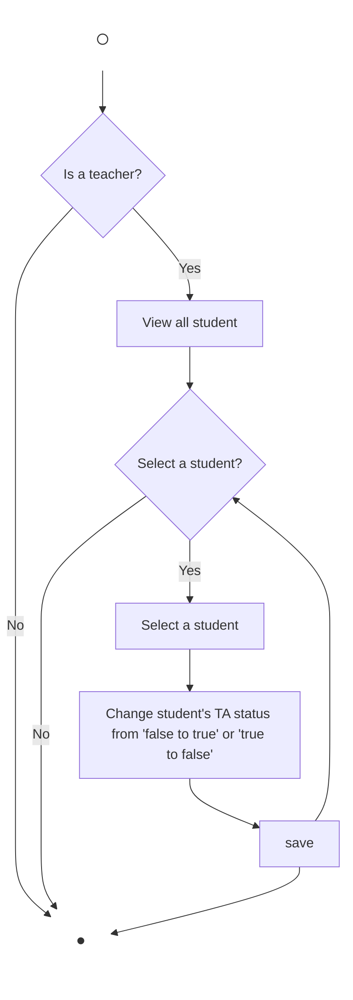

## Editing TA

```mermaid
graph TD
    classDef points fill:transparant,stroke:none,stroke-width:0px, fill-opacity:0, font-size:30px

    start["#cir;"]:::points
    exit["#bull;"]:::points

    start --> id{Is a teacher?}
    id --> |No| exit
    id --> |Yes| v[View all student]
    v --> sel{Select a student?}

    sel --> |No| exit
    sel --> |Yes| se[Select a student]
    se --> c["Change student's TA status from 'false to true' or 'true to false'"]
    c --> s[save]
    s --> sel
    s --> exit
```