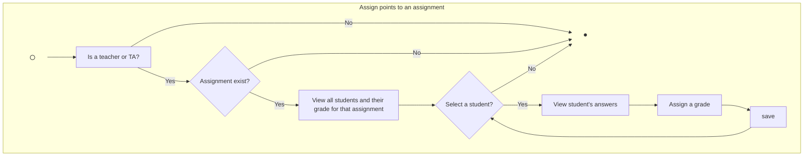
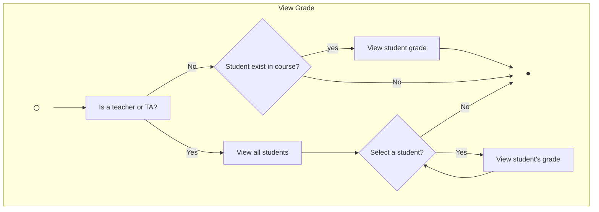

## Grading

```mermaid
graph TD
classDef points fill:transparant,stroke:none,stroke-width:0px, fill-opacity:0, font-size:30px

subgraph Assign points to an assignment
    start["#cir;"]:::points
    exit["#bull;"]:::points

    start --> id[Is a teacher or TA?]
    id --> |No| exit
    id --> |Yes| a{Assignment exist?}

    a --> |No| exit
    a --> |Yes| v[View all students and their grade for that assignment]
    
    v --> sel{Select a student?}
    sel --> |No| exit
    sel --> |Yes| va[View student's answers]
    va --> as[Assign a grade]
    as --> save
    save --> sel
end
```

```mermaid
graph TD
classDef points fill:transparant,stroke:none,stroke-width:0px, fill-opacity:0, font-size:30px
subgraph View Grade
    start2["#cir;"]:::points
    exit2["#bull;"]:::points

    start2 --> id2[Is a teacher or TA?]
    id2 --> |No| g2{Student exist in course?}
    id2 --> |Yes| v2[View all students]
    
    v2 --> sel2{Select a student?}
    sel2 --> |No| exit2
    sel2 --> |Yes| va2[View student's grade]
    va2 --> sel2

    g2 --> |yes| g3[View student grade]
    g3 --> exit2
    g2 --> |No| exit2
end
```