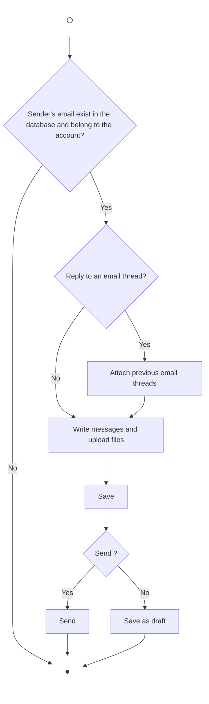

## Inbox

```mermaid
graph TD
classDef points fill:transparant,stroke:none,stroke-width:0px, fill-opacity:0, font-size:30px
    start["#cir;"]:::points
    exit["#bull;"]:::points

    start --> s{Sender's email exist in the database and belong to the account?}
    s --> |No| exit
    s --> |Yes| reply{Reply to an email thread?}

    reply --> |No| w[Write messages and upload files]
    reply --> |Yes| att[Attach previous email threads]
    att --> w --> Save
    Save --> send{Send ?}

    send --> |Yes| sc[Send] --> exit
    send --> |No| sc2[Save as draft] --> exit
```