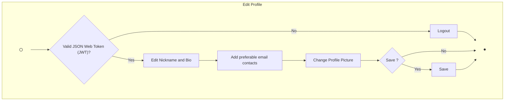
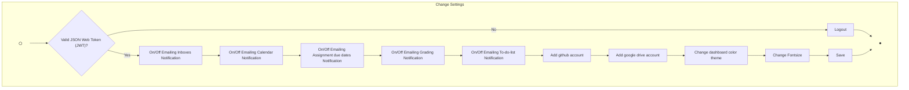

## Profile

```mermaid
graph TD
classDef points fill:transparant,stroke:none,stroke-width:0px, fill-opacity:0, font-size:30px

subgraph Edit Profile
    start["#cir;"]:::points
    exit["#bull;"]:::points

    start --> vr{"Valid JSON Web Token (JWT)?"}
    vr --> |No| Logout --> exit
    vr --> |Yes| edit[Edit Nickname and Bio]
    edit --> c[Add preferable email contacts]
    c --> pf[Change Profile Picture]
    pf --> s{Save ?}
    s --> |No| exit
    s --> |Yes| Save
    Save --> exit
end
```

```mermaid
graph TD
classDef points fill:transparant,stroke:none,stroke-width:0px, fill-opacity:0, font-size:30px
subgraph Change Settings
    start1["#cir;"]:::points
    exit1["#bull;"]:::points

    start1 --> vr1{"Valid JSON Web Token (JWT)?"}
    vr1 --> |No| Logout1[Logout] --> exit1
    vr1 --> |Yes| c1[On/Off Emailing Inboxes Notification]
    c1 --> c1.1[On/Off Emailing Calendar Notification]
    c1.1 --> c1.2[On/Off Emailing Assignment due dates Notification]
    c1.2 --> c1.3[On/Off Emailing Grading Notification]
    c1.3 --> c1.4[On/Off Emailing To-do-list Notification]
    c1.4 --> c2[Add github account]
    c2 --> c3[Add google drive account]
    c3 --> c4[Change dashboard color theme]
    c4 --> c5[Change Fontsize]
    c5 --> s2[Save] --> exit1
end
```