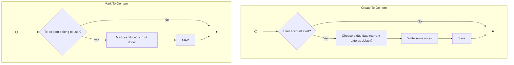
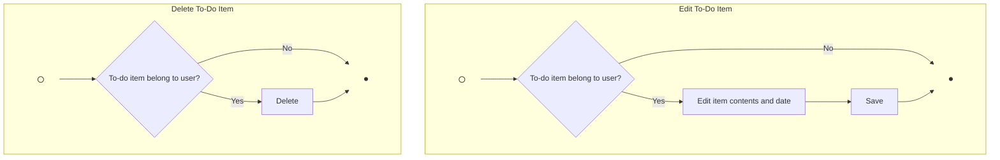

## To-do list

```mermaid
graph TD
classDef points fill:transparant,stroke:none,stroke-width:0px, fill-opacity:0, font-size:30px

subgraph Create To-Do Item
    start["#cir;"]:::points
    exit["#bull;"]:::points
    
    start --> vr{User account exist?}
    vr --> |No| exit
    vr --> |Yes| ch["Choose a due date (current date as default)"]
    ch --> wr[Write some notes]
    wr --> Save --> exit
end

subgraph Mark To-Do Item
    start2["#cir;"]:::points
    exit2["#bull;"]:::points

    start2 --> ch2{"To-do item belong to user?"}
    ch2 --> |No| exit2
    ch2 --> |Yes| mk["Mark as `done` or `not done`"]
    mk --> s2[Save] --> exit2
end
```

```mermaid
graph TD
classDef points fill:transparant,stroke:none,stroke-width:0px, fill-opacity:0, font-size:30px

subgraph Edit To-Do Item
    start["#cir;"]:::points
    exit["#bull;"]:::points

    start --> vr{"To-do item belong to user?"}
    vr --> |No| exit
    vr --> |Yes| ed[Edit item contents and date]
    ed --> Save --> exit
end

subgraph Delete To-Do Item
    start2["#cir;"]:::points
    exit2["#bull;"]:::points

    start2 --> vr2{"To-do item belong to user?"}
    vr2 --> |No| exit2
    vr2 --> |Yes| Delete --> exit2
end
```