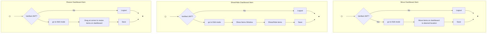

## Personalize Dashboard

```mermaid
graph TD
classDef points fill:transparant,stroke:none,stroke-width:0px, fill-opacity:0, font-size:30px

subgraph Move Dashboard Item
    start["#cir;"]:::points
    exit["#bull;"]:::points

    start --> vr{Verified JWT?}
    vr --> |No| lg1[Logout] --> exit
    vr --> |Yes| ed[go to Edit mode] --> mv[Move items on dashboard to desired location]
    mv --> Save --> exit
end

subgraph Show/Hide Dashboard Item
    start2["#cir;"]:::points
    exit2["#bull;"]:::points

    start2 --> vr2{Verified JWT?}
    vr2 --> |No| lg[Logout] --> exit2
    vr2 --> ed2[go to Edit mode] --> shw[Show Items Window] --> sh[Show/Hide items]
    sh --> s3[Save] --> exit2
end

subgraph Resize Dashboard Item
    start3["#cir;"]:::points
    exit3["#bull;"]:::points

    start3 --> vr3{Verified JWT?}
    vr3 --> |No| lg4[Logout] --> exit3
    vr3 --> ed3[go to Edit mode] --> rz[Drag at corner to resize items on dashboard]
    rz --> s2[Save] --> exit3
end
```