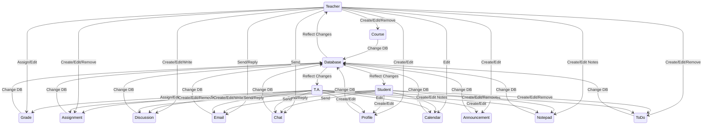

# Data Flow Diagram - Redesigning Canvas

```mermaid

stateDiagram-v2
    Teacher --> Course: Create/Edit/Remove
    T.A. --> Grade: Assign/Edit
    Teacher --> Grade: Assign/Edit
    T.A. --> Assignment: Create/Edit/Remove
    Teacher --> Assignment: Create/Edit/Remove
    Student --> Assignment: Submit
    Teacher --> Discussion: Create/Edit/Write
    T.A. --> Discussion: Create/Edit/Write
    Student --> Discussion: Write
    Teacher --> Email: Send/Reply
    Student --> Email: Send/Reply
    T.A. --> Email: Send/Reply
    Teacher --> Chat: Send
    Student --> Chat: Send
    T.A. --> Chat: Send
    Teacher --> Profile: Create/Edit
    Student --> Profile: Create/Edit
    T.A. --> Profile: Create/Edit
    Teacher --> Announcement: Create/Edit
    T.A. --> Announcement: Create/Edit
    Teacher --> Calendar: Edit
    Student --> Calendar: Edit
    T.A. --> Calendar: Edit
    Teacher --> Notepad: Create/Edit Notes
    Student --> Notepad: Create/Edit Notes
    T.A. --> Notepad: Create/Edit Notes
    Teacher --> ToDo: Create/Edit/Remove
    Student --> ToDo: Create/Edit/Remove
    T.A. --> ToDo: Create/Edit/Remove
    Course --> Database: Change DB
    Grade --> Database: Change DB
    Assignment --> Database: Change DB
    Discussion --> Database: Change DB
    Email --> Database: Change DB
    Chat --> Database: Change DB
    Profile --> Database: Change DB
    Announcement --> Database: Change DB
    Calendar --> Database: Change DB
    Notepad --> Database: Change DB
    ToDo --> Database: Change DB
    Database --> Teacher: Reflect Changes
    Database --> T.A.: Reflect Changes
    Database --> Student: Reflect Changes
```