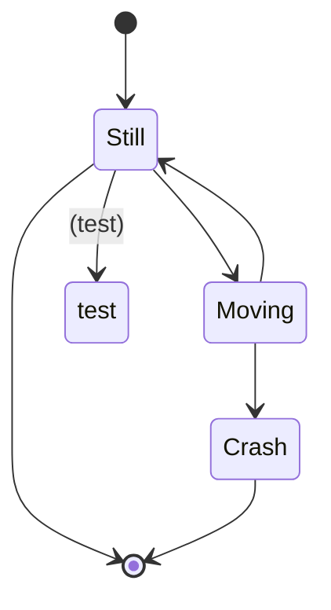

# Test1
## Test2

```mermaid

stateDiagram-v2
    [*] --> Still
    Still --> [*]

    Still --> Moving
    Moving --> Still
    Moving --> Crash
    Crash --> [*]
    
    Still --> test : (test)

```